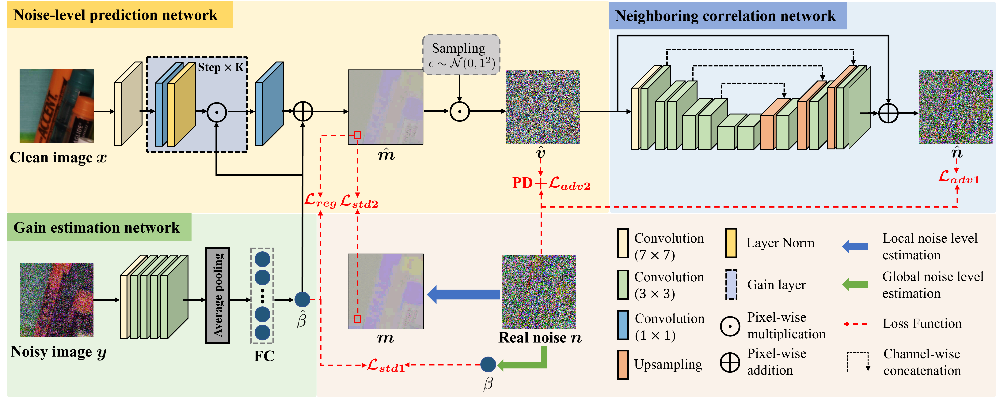
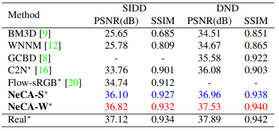

# sRGB Real Noise Synthesizing with Neighboring Correlation-Aware Noise Model (CVPR'23)

This is the official inplementation of CVPR 2023 paper [sRGB Real Noise Synthesizing with Neighboring Correlation-Aware Noise Model](https://openaccess.thecvf.com/content/CVPR2023/papers/Fu_sRGB_Real_Noise_Synthesizing_With_Neighboring_Correlation-Aware_Noise_Model_CVPR_2023_paper.pdf). 

## Abstract 

Modeling and synthesizing real noise in the standard RGB (sRGB) domain is challenging due to the complicated noise distribution. While most of the deep noise generators
proposed to synthesize sRGB real noise using an end-to-end trained model, the lack of explicit noise modeling degrades the quality of their synthesized noise. In this work, we propose to model the real noise as not only dependent on the underlying clean image pixel intensity, but also highly correlated to its neighboring noise realization within the local region. Correspondingly, we propose a novel noise synthesizing framework by explicitly learning its neighboring correlation on top of the signal dependency. With the proposed noise model, our framework greatly bridges the distribution gap between synthetic noise and real noise. We show that our generated “real” sRGB noisy images can be used for training supervised deep denoisers, thus to improve their real denoising results with a large margin, comparing to the popular classic denoisers or the deep denoisers that are trained on other sRGB noise generators.

For more details, please refer to our original [paper](https://openaccess.thecvf.com/content/CVPR2023/papers/Fu_sRGB_Real_Noise_Synthesizing_With_Neighboring_Correlation-Aware_Noise_Model_CVPR_2023_paper.pdf).




## Setup

### Requirements

- PyTorch 1.13.1
- CUDA 11.7
- Python 3.9
- opencv 4.7.0
- numpy 1.21.5

### Directory

Descriptions of code directory.

```
sRGB-Noise-Synthesis
|-- data
|-- data_preparation
|-- Datasets
    |-- SIDD_Medium_Srgb_Parts
    |-- SIDD_Medium_Crop
|-- models
|-- options
|-- pretrain
|-- saves
|-- test
    |-- imgs
    |-- saves
|-- utils
```

### Pretrained models

Download pretrained checkpoints here and place them into `/pretrain/` folder.

Google drive: | Camera name | [IP](https://drive.google.com/drive/folders/1jouUbKfSz9vpvChuY5J-gvWN4JLkYs3H?usp=sharing) | [G4](https://drive.google.com/drive/folders/1oqhax1aESnqIx6q4jVqp_7XuoloGlJuk?usp=sharing) | [GP](https://drive.google.com/drive/folders/1L2lzAMmzUT1flYWdkmTtGnPAWBirGvAr?usp=sharing) | [N6](https://drive.google.com/drive/folders/1I7TEWZ2HnEVjAvE24wwYGBQvElqqdEH4?usp=sharing) | [S6](https://drive.google.com/drive/folders/1HgHNluBdvky5HHB-fvRDelfBRv9gebcT?usp=sharing) |

## Quick test

Test our noise synthesis pipeline with pre-trained models

1. place noisy-clean image pairs into `/test/imgs/` folder. Name noisy image as `noisy.png`, clean image as `clean.png`. 
2. Run the code as 
  ```python main_test.py --cam_name IP --NeCA_type S```. You can also control detail test configurations (e.g. cam_name: IP/GP/G4/N6/S6, NecA_type: S/W).
3. Images are saved in `/test/saves/` folder.

## Train

1. Download SIDD-Medium sRGB part at [here](https://www.eecs.yorku.ca/~kamel/sidd/dataset.php).
2. Use `Crop_SIDD.py` to crop images into 512×512 patches.
3. Run the code as

```
python main_train_jointly.py --dir_save './saves/noise_syn/' --train_img_dir './Datasets/SIDD_Medium_Crop/' --data_prep_dir './data_preparation/' --not_aug --patch_size 96 --cam_name GP --batch_size 16 --num_workers 8 --verbose --epochs 5000 --gpu_ids 0 --joint_start_epoch 50 --seperate_train --gan_mode wgangp --test_epoch 5 --lr_decay_2 80 
```

## Results

### Visual results

<p align=center></p>

### Denoising performance on SIDD/DND benchmark
<p align=center></p>

## Reference

Our implementation is based on [KAIR](https://github.com/cszn/KAIR), [CycleGAN](https://github.com/junyanz/CycleGAN). We would like to thank them.

## Citation
```
@InProceedings{Fu_2023_CVPR,
    author    = {Fu, Zixuan and Guo, Lanqing and Wen, Bihan},
    title     = {sRGB Real Noise Synthesizing With Neighboring Correlation-Aware Noise Model},
    booktitle = {Proceedings of the IEEE/CVF Conference on Computer Vision and Pattern Recognition (CVPR)},
    month     = {June},
    year      = {2023},
    pages     = {1683-1691}
}
```